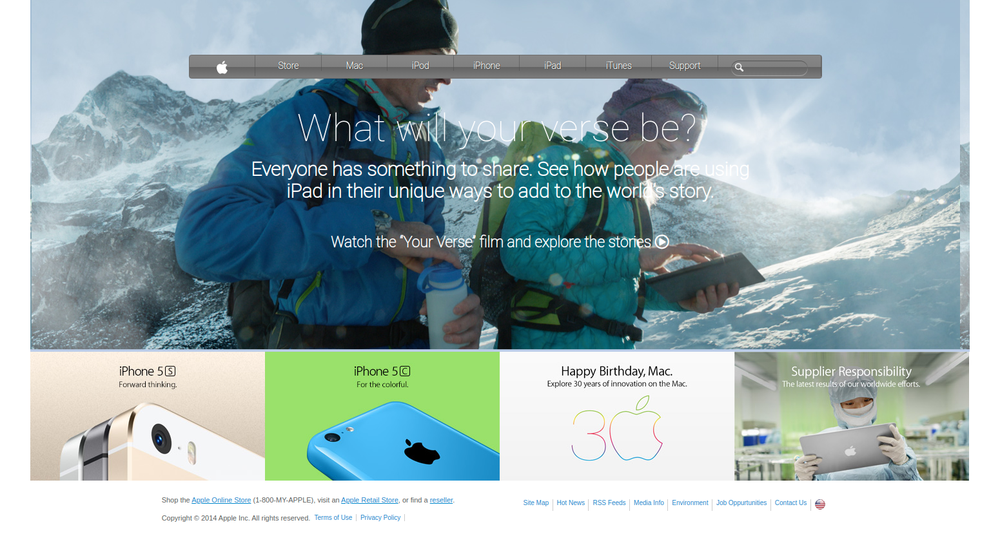

# Apple Home Page Clone

The Apple Home Page Clone project is aimed at applying the knowledge of basic HTML and CSS structure to build an exact copy of Apple Home Page.

[Click To Check The Original One](https://web.archive.org/web/20140301004610/http://www.apple.com/)

## Authors

This project was executed by the duo of :

- [Mohamed Naser](https://www.linkedin.com/in/mohamednaseramein/)

## Used Tools

- HTML
- CSS
- Flex & Grids
- FontAwsome v5.11.2
- MarkDown Syntax

## Done Work

- [x] Create main Navigation section
- [x] Crete promos section
- [x] Crete footer section
- [x] Use Semintaic HTML
- [x] check CSS with stylelint
- [x] Check html with W3C validator
- [x] Validate Readme file with markdown lint

## Setup

Open your git bash and cd to the location you'd like to put your files the run the command below.

```console
git clone git@github.com:mohamednaser/apple-home-page-clone.git
```

## Live Version

Live version [here](https://mohamednaser.github.io/apple-home-page-clone/).

## ScreenShot For Page


